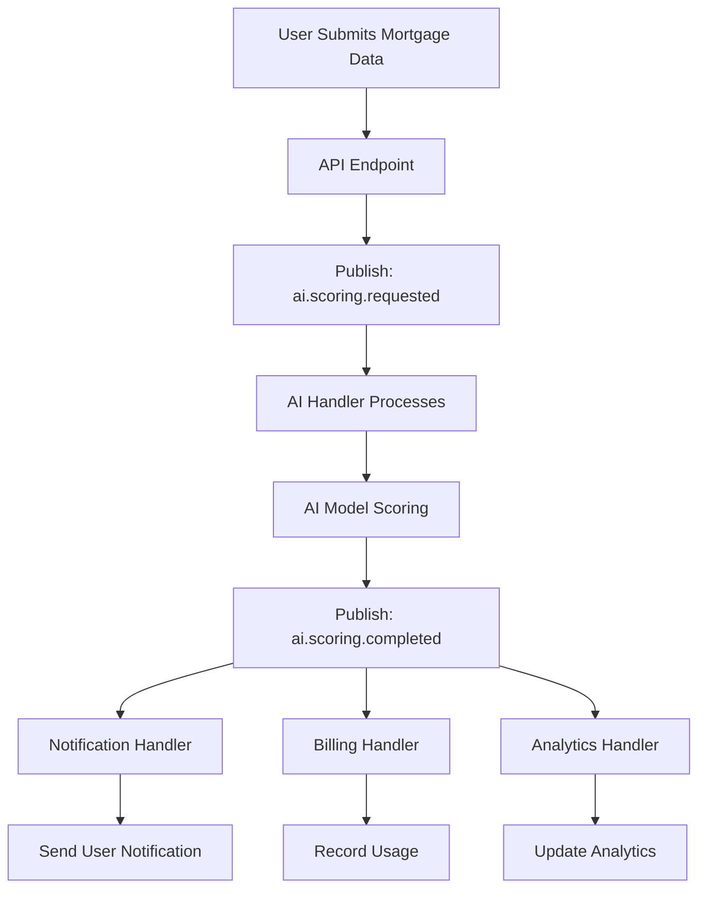
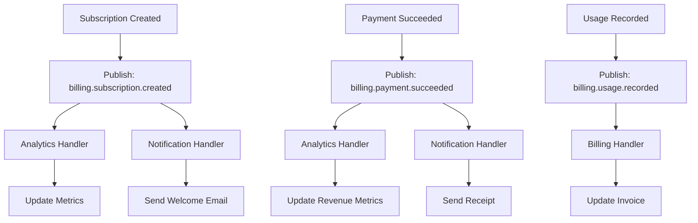
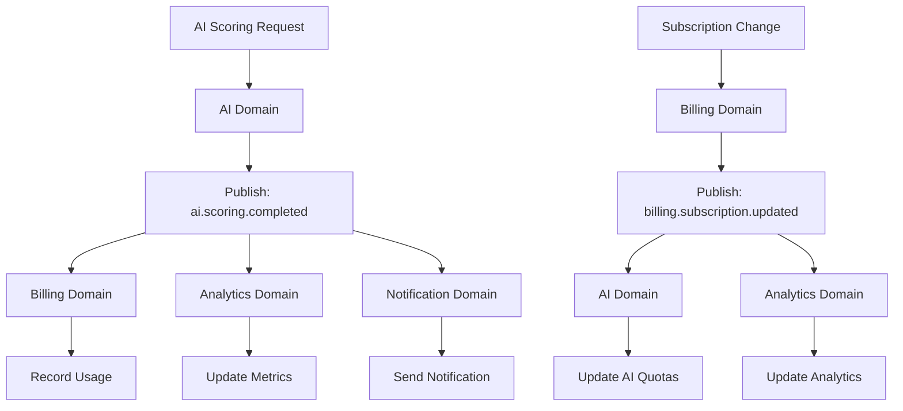

# Event Flow Documentation - MortgageMatchPro v1.4.0

## Overview

This document outlines the event-driven architecture flow for MortgageMatchPro, showing how different domains communicate through events and how the system maintains loose coupling while ensuring data consistency.

## Event Architecture

### Core Components

1. **Event Bus** (`events/event-bus.ts`)
   - Central event routing and processing
   - Retry mechanisms and error handling
   - Metrics and monitoring

2. **Event Schemas** (`events/schemas/`)
   - Type-safe event contracts
   - Domain-specific event definitions
   - Version management

3. **Event Handlers** (`events/handlers/`)
   - Domain-specific event processing
   - Business logic implementation
   - Cross-domain communication

4. **Event Publishers** (`events/publishers/`)
   - Domain service integration
   - Event publishing utilities
   - Event sourcing

## Event Flow Diagrams

### 1. AI Scoring Flow



### 2. Billing Flow



### 3. Cross-Domain Integration



## Event Types by Domain

### AI Domain Events

| Event Type | Description | Triggers |
|------------|-------------|----------|
| `ai.scoring.requested` | User requests mortgage scoring | AI processing, usage tracking |
| `ai.scoring.completed` | Scoring process finished | Notifications, analytics |
| `ai.scoring.failed` | Scoring process failed | Error handling, retry logic |
| `ai.model.updated` | AI model updated | Cache invalidation, notifications |
| `ai.cost.threshold_exceeded` | AI usage exceeds limit | Throttling, alerts |

### Billing Domain Events

| Event Type | Description | Triggers |
|------------|-------------|----------|
| `billing.subscription.created` | New subscription created | Welcome flow, analytics |
| `billing.subscription.updated` | Subscription modified | Feature updates, notifications |
| `billing.subscription.cancelled` | Subscription cancelled | Cleanup, retention |
| `billing.payment.succeeded` | Payment processed | Receipt, analytics |
| `billing.payment.failed` | Payment failed | Retry logic, notifications |
| `billing.usage.recorded` | Usage tracked | Invoice updates, analytics |

### Analytics Domain Events

| Event Type | Description | Triggers |
|------------|-------------|----------|
| `analytics.event.recorded` | User action tracked | Dashboard updates, reports |
| `analytics.metric.updated` | KPI updated | Alerts, notifications |
| `analytics.report.generated` | Report created | Email delivery, storage |

### Notification Domain Events

| Event Type | Description | Triggers |
|------------|-------------|----------|
| `notification.user.sent` | User notification sent | Delivery tracking, analytics |
| `notification.admin.sent` | Admin notification sent | Audit logging, escalation |
| `notification.email.sent` | Email notification sent | Delivery tracking, bounce handling |

## Event Processing Patterns

### 1. Request-Response Pattern

```typescript
// Publish event and wait for response
const eventId = await publish('ai.scoring.requested', data);
const response = await waitForEvent('ai.scoring.completed', eventId);
```

### 2. Fire-and-Forget Pattern

```typescript
// Publish event without waiting
await publish('analytics.event.recorded', {
  userId,
  action: 'page_view',
  timestamp: new Date().toISOString()
});
```

### 3. Saga Pattern

```typescript
// Multi-step process with compensation
await publish('billing.subscription.created', data);
// If payment fails, compensate
await publish('billing.subscription.cancelled', {
  reason: 'payment_failed',
  subscriptionId: data.subscriptionId
});
```

## Error Handling and Retry Logic

### Retry Configuration

```typescript
const retryConfig = {
  maxRetries: 3,
  retryDelay: 1000, // 1 second
  exponentialBackoff: true,
  maxRetryDelay: 30000 // 30 seconds
};
```

### Error Types

1. **Transient Errors**: Network issues, temporary service unavailability
   - Automatic retry with exponential backoff
   - Dead letter queue after max retries

2. **Business Logic Errors**: Invalid data, business rule violations
   - No retry, immediate failure
   - Error notification to administrators

3. **System Errors**: Database connection, configuration issues
   - Alert administrators
   - Circuit breaker pattern

## Event Monitoring and Metrics

### Key Metrics

1. **Event Throughput**
   - Events published per second
   - Events processed per second
   - Queue depth

2. **Error Rates**
   - Failed event processing
   - Retry attempts
   - Dead letter queue size

3. **Latency**
   - Event processing time
   - End-to-end event flow time
   - Queue wait time

### Monitoring Dashboard

```typescript
const metrics = {
  eventsPublished: 1250,
  eventsProcessed: 1245,
  eventsFailed: 5,
  averageProcessingTime: 150, // ms
  queueSize: 10,
  subscriptionsActive: 25
};
```

## Event Sourcing

### Event Store

Events are stored for:
- Audit trail
- Replay capability
- Debugging
- Analytics

### Event Replay

```typescript
// Replay events from a specific point in time
const events = await eventStore.getEvents({
  from: '2024-01-01T00:00:00Z',
  to: '2024-01-02T00:00:00Z',
  eventType: 'ai.scoring.completed'
});
```

## Best Practices

### 1. Event Design

- **Immutable**: Events should never change after creation
- **Versioned**: Include version information for backward compatibility
- **Idempotent**: Event handlers should be idempotent
- **Atomic**: Each event should represent a single business action

### 2. Event Naming

- Use dot notation: `domain.action.status`
- Be descriptive: `billing.subscription.created`
- Include version: `ai.scoring.requested.v1`

### 3. Event Data

- Include correlation IDs for tracing
- Add timestamps for ordering
- Include user/tenant context
- Keep payloads minimal but complete

### 4. Error Handling

- Implement circuit breakers
- Use dead letter queues
- Monitor error rates
- Alert on critical failures

## Testing Event Flows

### Unit Testing

```typescript
describe('AI Scoring Flow', () => {
  it('should process scoring request', async () => {
    const event = createMockEvent('ai.scoring.requested');
    await handleAIScoringRequested(event);
    expect(mockPublish).toHaveBeenCalledWith('ai.scoring.completed');
  });
});
```

### Integration Testing

```typescript
describe('Event Flow Integration', () => {
  it('should complete full scoring flow', async () => {
    await publish('ai.scoring.requested', mockData);
    await waitForEvent('ai.scoring.completed');
    await waitForEvent('notification.user.sent');
    expect(analytics.getMetrics()).toMatchSnapshot();
  });
});
```

## Performance Considerations

### 1. Event Batching

```typescript
// Batch multiple events for efficiency
const events = [event1, event2, event3];
await publishBatch(events);
```

### 2. Async Processing

```typescript
// Process events asynchronously
await publish('analytics.event.recorded', data);
// Don't wait for processing
```

### 3. Event Filtering

```typescript
// Only process events for active tenants
if (event.metadata.tenantId && isTenantActive(event.metadata.tenantId)) {
  await processEvent(event);
}
```

## Security Considerations

### 1. Event Validation

- Validate event schemas
- Sanitize event data
- Check permissions

### 2. Event Encryption

- Encrypt sensitive data
- Use secure transport
- Implement access controls

### 3. Audit Logging

- Log all event processing
- Track event access
- Monitor for anomalies

## Future Enhancements

1. **Event Streaming**: Real-time event processing with Apache Kafka
2. **Event Replay**: Advanced replay capabilities for debugging
3. **Event Analytics**: ML-powered event pattern analysis
4. **Event Federation**: Cross-service event sharing
5. **Event Versioning**: Advanced versioning and migration strategies

## Conclusion

The event-driven architecture provides a robust, scalable foundation for MortgageMatchPro's domain communication. By following these patterns and best practices, the system maintains loose coupling while ensuring data consistency and reliability.

For questions or clarifications, please refer to the individual event handler implementations or contact the development team.
