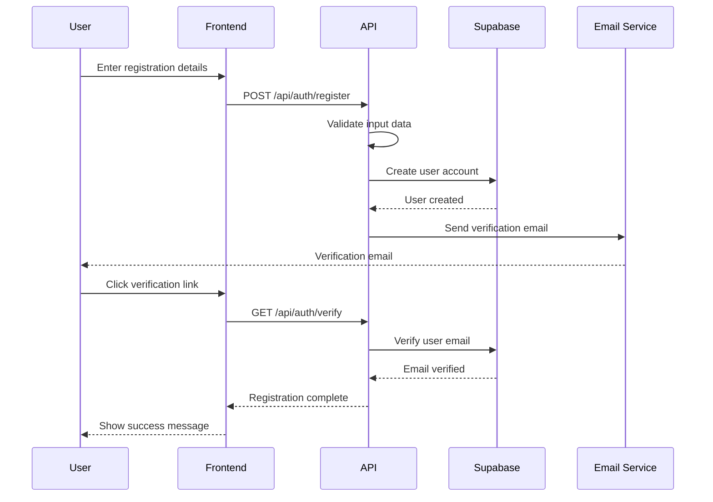
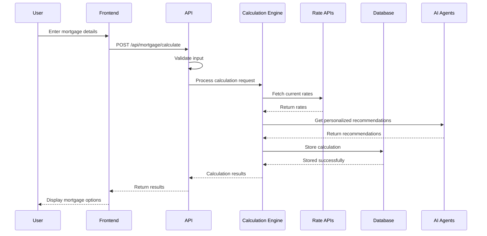
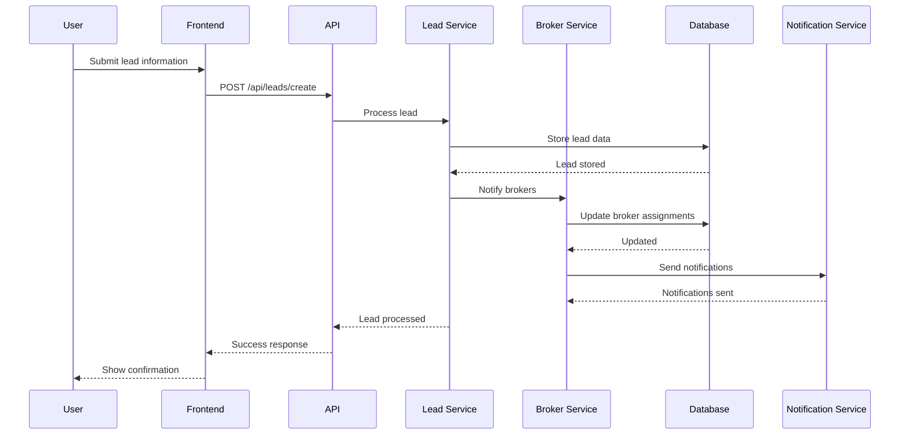
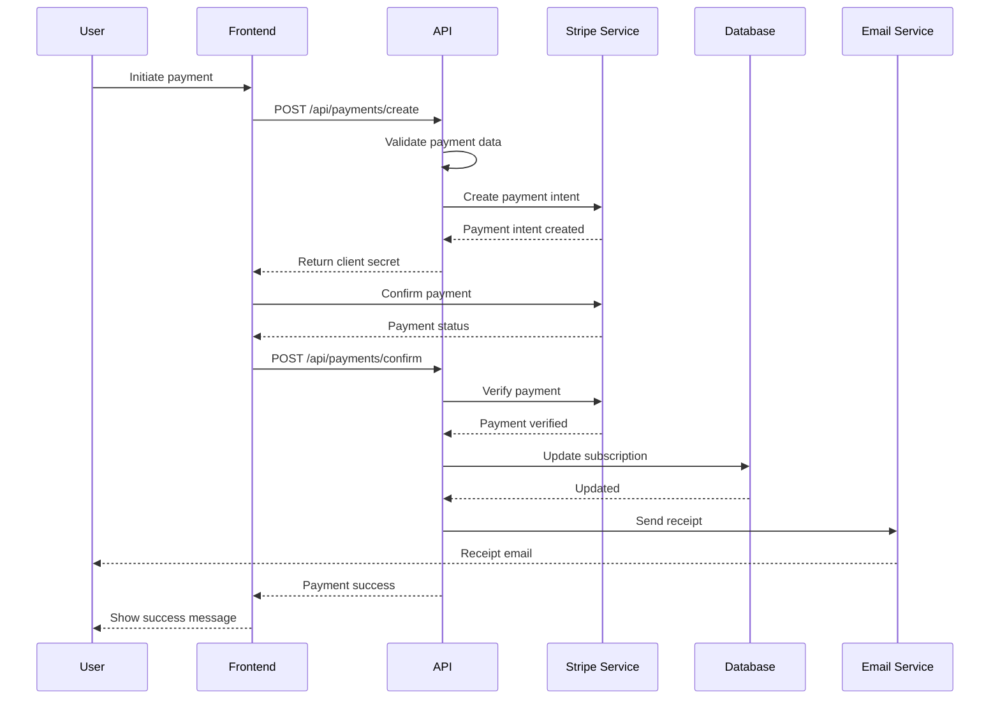
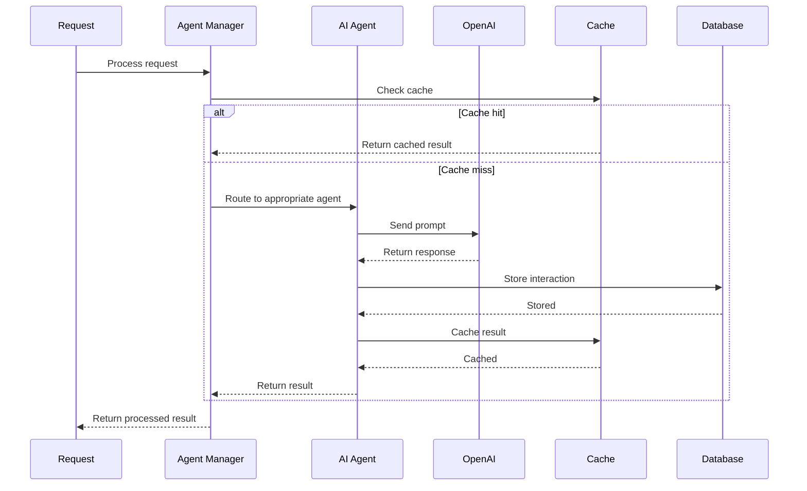
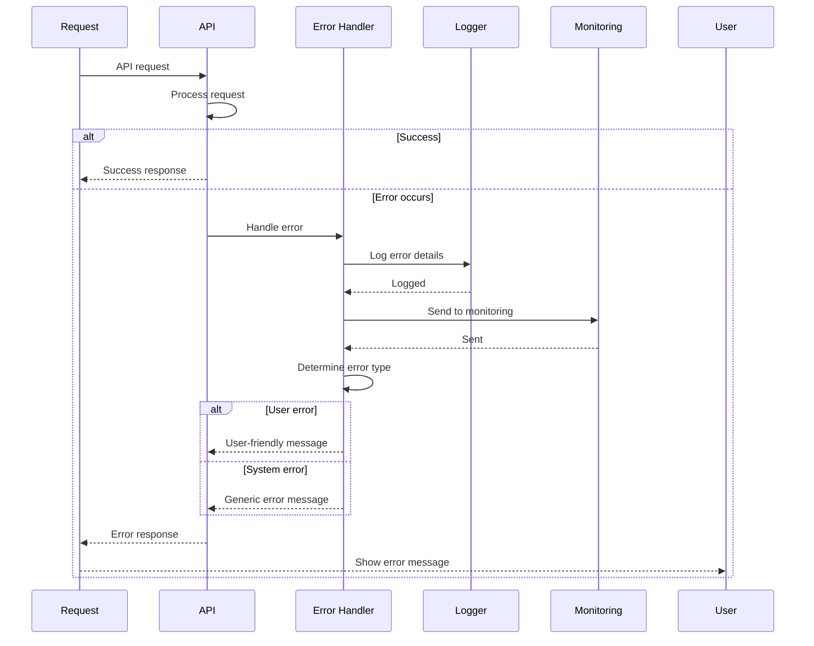
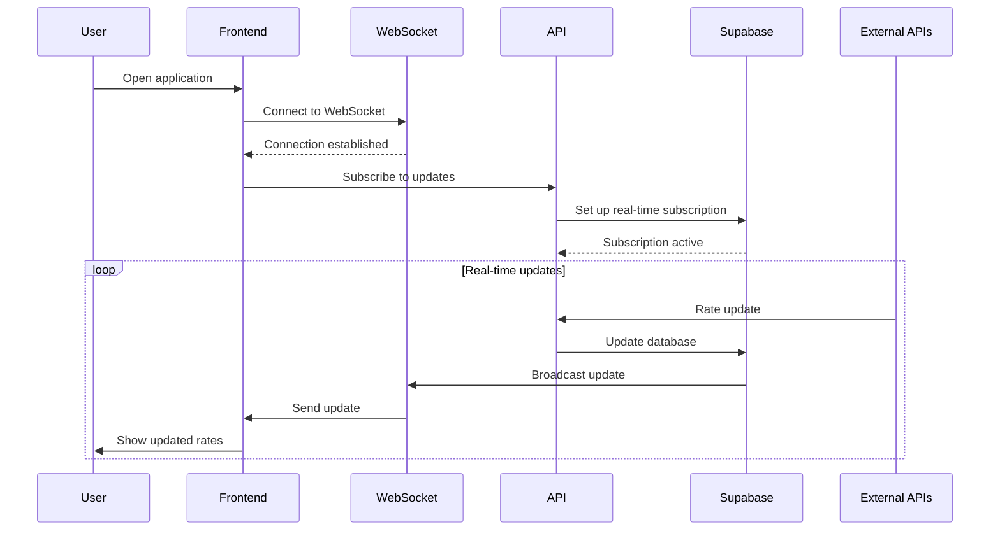
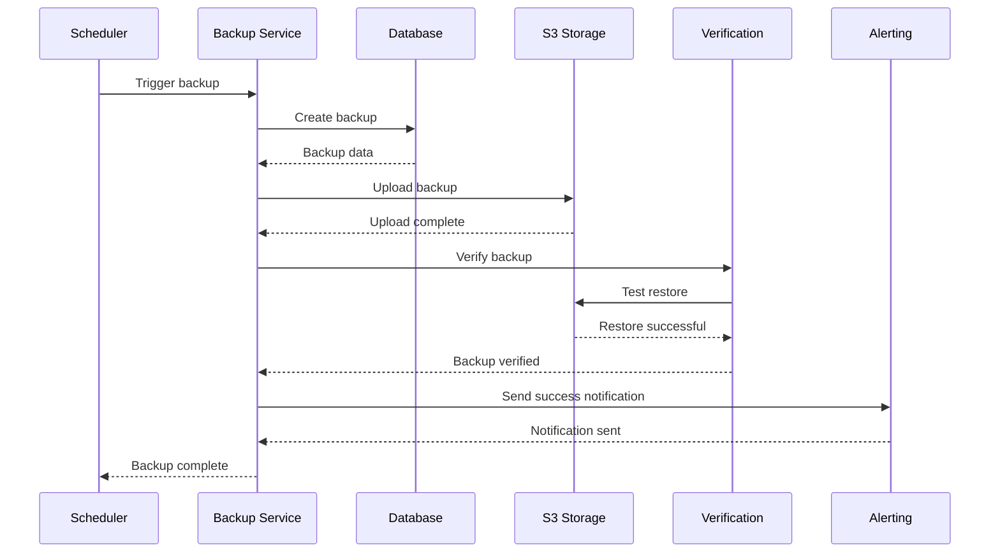
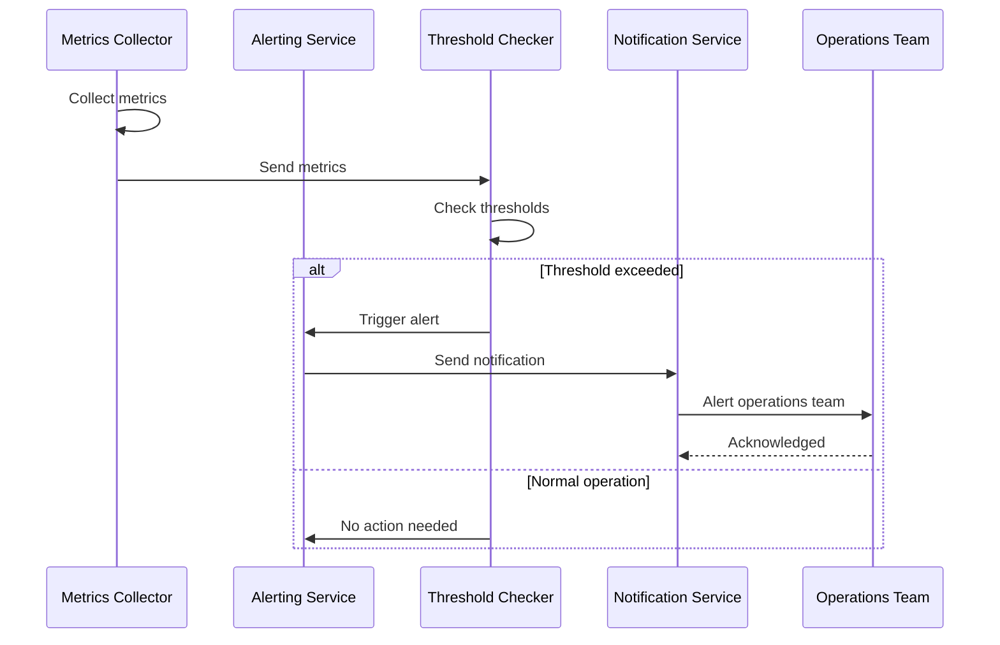
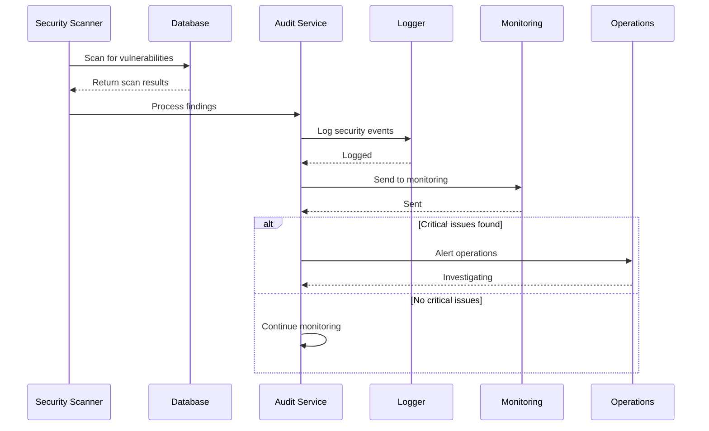

# Data Flow Diagrams

## User Registration Flow

## Mortgage Calculation Flow

## Lead Management Flow

## Payment Processing Flow

## AI Agent Processing Flow

## Error Handling Flow

## Real-time Updates Flow

## Backup and Recovery Flow

## Monitoring and Alerting Flow

## Security Audit Flow

