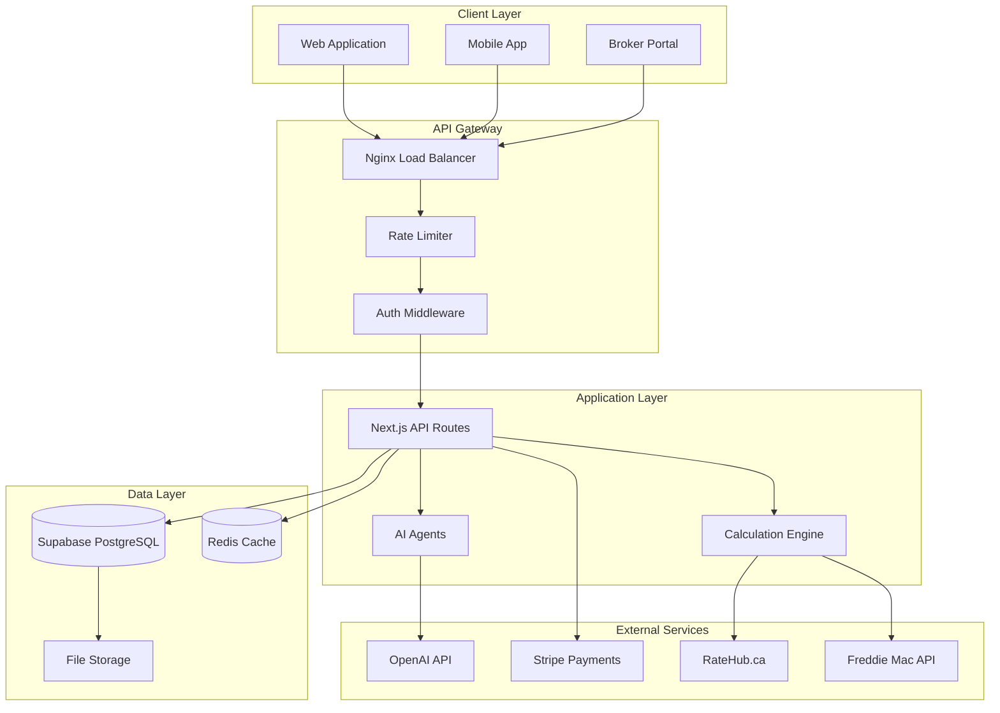
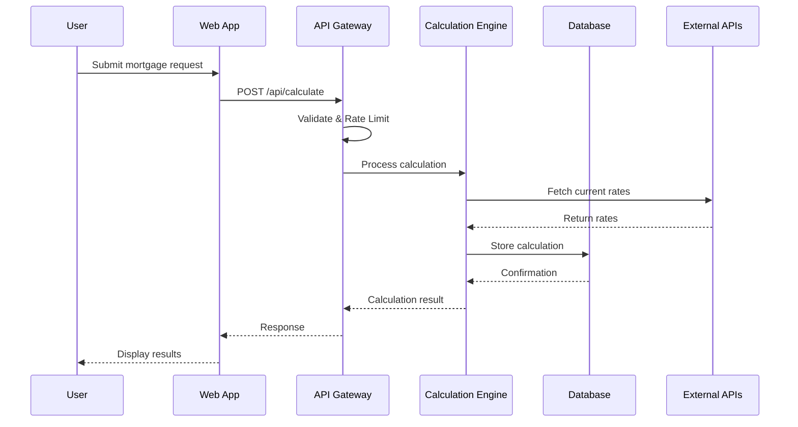
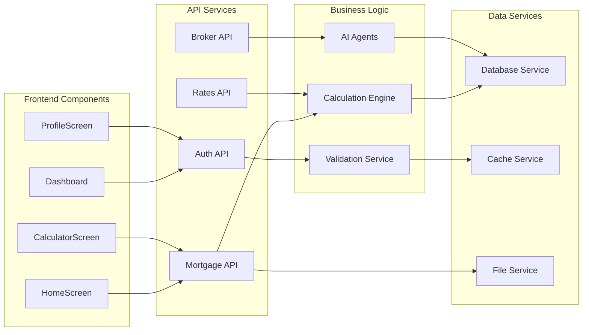
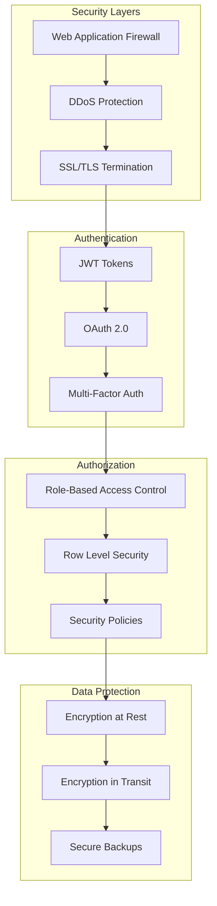
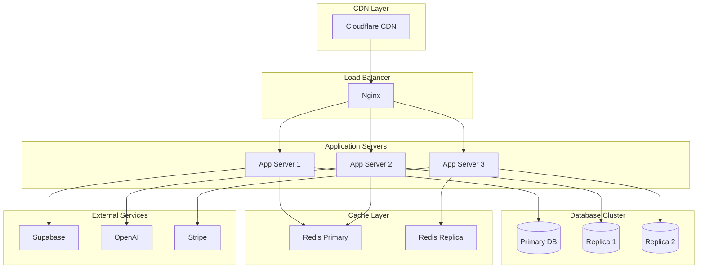

# System Architecture Overview

## High-Level Architecture

## Data Flow Architecture

## Component Relationships

## Security Architecture

## Deployment Architecture

## Technology Stack

### Frontend
- **Framework**: Next.js 14 with App Router
- **Styling**: Tailwind CSS
- **State Management**: Zustand
- **Mobile**: React Native with Expo
- **UI Components**: Custom responsive components

### Backend
- **Runtime**: Node.js 18+
- **Framework**: Next.js API Routes
- **Database**: Supabase (PostgreSQL)
- **Cache**: Redis
- **Authentication**: Supabase Auth

### AI & ML
- **Language Model**: OpenAI GPT-4
- **Agents**: Custom AI agent framework
- **Processing**: Server-side processing

### Infrastructure
- **Hosting**: Vercel
- **CDN**: Cloudflare
- **Monitoring**: Sentry, PostHog
- **Analytics**: Custom analytics

### Security
- **Encryption**: AES-256-GCM
- **Rate Limiting**: Redis-based
- **Validation**: Zod schemas
- **Audit**: Comprehensive logging